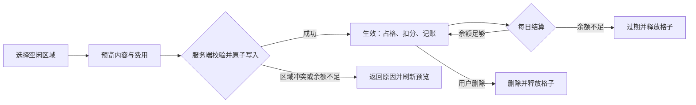
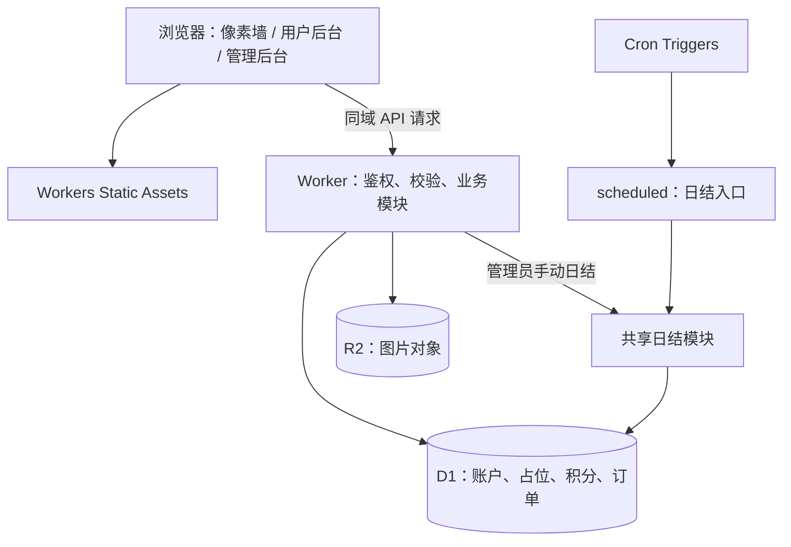

# GeoPixel Wall

一个参考“百万格子”模式的公共像素墙：用户用积分占用矩形区域，展示文字、图片与链接；持续占用需要每日支付积分，余额不足时释放位置，让有限的展示空间持续流转。

目标是使用 Cloudflare Workers、D1、R2 与 Cron Triggers 实现前后端一体部署，适合个人站点和小型社区。

> **当前状态：首版实现完成（本地验证）。** 工程骨架、数据库迁移、后端 API、前端页面与集成测试已就位：`npm run check`（类型检查）与 `npm test`（39 个集成测试）全部通过，`npx wrangler deploy --dry-run` 打包成功。远程部署、Cron 实际触发与 Playwright 浏览器验收尚未执行，详见 `docs/review.md`。

## 设计思路

### 1. 产品定位与边界

像素墙的核心资源是“展示面积 × 占用时间”。一次性发布成本用于约束随意占位，每日维护成本用于回收长期无人维护的内容；积分流水让每次收费和奖励都可追溯。

首版围绕“获取积分 → 选择区域 → 发布内容 → 每日续占或到期释放”形成闭环：

| 角色 | 目标能力 |
| --- | --- |
| 访客 | 浏览像素墙、悬停查看内容信息、点击打开外链、通过邀请链接访问 |
| 注册用户 | 管理账户、获取积分、上传图片、发布和维护自己的内容、查看账本与捐助订单 |
| 管理员 | 首个注册用户自动担任（或经一次性初始化）；调整参数、搜索用户、批量发积分、核实捐助到账、触发日结、查看操作记录 |

首版采用手动确认捐助到账。自动支付回调、多面墙、实时协作和竞价排名列为后续扩展，不作为首版验收条件。

### 2. 格子坐标与交互

- 默认墙面为 `100 × 100` 个格子，共 `10,000` 格；每格对应 `10 × 10` 个逻辑像素，整墙为 `1,000 × 1,000` 逻辑像素。这里的格子数与“百万格子”参考名称不同。
- 区域使用整数坐标 `(x, y, width, height)`，原点在左上角。边界规则为 `0 ≤ x`、`0 ≤ y`、`width ≥ 1`、`height ≥ 1`、`x + width ≤ 100`、`y + height ≤ 100`。
- 登录用户拖选矩形区域，前端即时展示面积、发布费用和每日费用；服务端按当前配置重新计算，最终以服务端结果为准。价格变化时提示重新确认。
- 桌面与触屏统一使用 Pointer Events；支持反向拖选、取消选择，并提供坐标与尺寸输入作为键盘操作替代。缩放后仍按逻辑坐标提交。
- 首版用 CSS 绘制网格背景，按内容区域创建展示元素，避免为每个空格子创建独立 DOM；只返回展示所需字段。
- 纯文字内容块自适应字号：以 canvas 测量折行（CJK 逐字、英文按词），取能完整显示的最大字号；确实放不下时按最小字号渲染并加省略标记，悬停浮层可看全文。发布面板提供等比文字预览、按可读字号（12px）推荐完整显示所需格数并可一键应用；窗口尺寸变化时全部重算。悬停内容块显示完整信息（全文、位置尺寸、链接），点击带链接的内容块直接在新窗口打开（`noopener noreferrer`）。移动端允许缩放或滚动查看墙面，图片在所选矩形中按比例裁切；悬停浮层为桌面交互，触摸端的等价展示列为后续迭代。

`grid_posts` 保存一条内容的整体信息，`grid_cells` 保存有效内容实际占用的坐标。数据库通过唯一约束阻止同一坐标被重复占用，前端的空闲提示仅用于交互。

### 3. 发布与内容生命周期



内容至少包含文字或图片，可附带跳转链接。首版不支持富文本或自定义 HTML，文字以纯文本渲染，外链仅允许 `http:` 和 `https:`。

发布时，把内容记录、格子占用、余额扣减和积分流水作为同一次数据库事务处理：全部成功才返回发布成功，任何步骤失败都不能残留扣费或占位。区域冲突返回 `409`，余额不足返回明确的业务错误。

发布请求携带由客户端生成的业务请求 ID，服务端按“用户 ID + 请求 ID”去重，并保存请求摘要和成功结果。网络超时后使用原 ID 重试时返回原结果；同一 ID 携带不同内容时拒绝处理，不能只依靠前端禁用按钮防止重复扣费。

编辑仅允许修改文字、图片和链接，不改变位置、面积或计费快照；调整区域需删除后重新发布，并重新支付发布费用。删除和过期均释放占位，但保留内容状态及历史账本；已扣费用不退回，充值也不自动恢复已过期内容。

### 4. 积分模型与日结规则

设区域面积为 `A = width × height`，每格发布价格为 `P`，每格每日价格为 `D`：

| 项目 | 规则 |
| --- | --- |
| 一次性发布费用 | `A × P`，发布成功时扣除 |
| 每日占用费用 | `A × D`，按有效内容逐条结算 |
| 注册奖励 | 每个成功创建的账户发放一次 |
| 邀请奖励 | 符合去重与限额规则的访问发放一次 |
| 捐助积分 | 管理员确认实际到账后发放，创建订单不加分 |
| 批量赠送 | 管理员按选中的用户 ID 发放，每个批次对同一用户只发一次 |

示例：占用 `4 × 3` 格，`P = 2`、`D = 1`，则发布扣 `24` 积分，每日扣 `12` 积分。这些数字用于说明公式，不是已配置的默认值。

积分使用非负整数，余额不得透支；捐助金额以整数“分”保存。若兑换率为每元 `R` 积分，订单积分为 `floor(金额分 × R / 100)`，下单时显示并保存兑换率及积分结果，确认到账时不重新定价。

日结约定：

1. 统一按 **UTC 自然日**结算，计划每天 `00:00 UTC` 触发一次（北京时间 `08:00`，Cron 表达式 `0 0 * * *`）。发布当日只收发布费，首次日结在下一个 UTC 日界线，不按小时折算。
2. 每条内容在发布时保存 `P`、`D` 和下次应结算日期。费率调整只影响新发布内容；其他奖励与上传限制按各自操作发生时的配置执行。
3. 以“内容 ID + 应结算日期”作为唯一业务键。Cron 重试、管理员手动触发和并发触发均不能重复扣费；手动日结只能处理已经到期的日期。
4. 同一用户同一天的内容按“发布时间、内容 ID”排序结算，并串行处理该用户的余额。同一余额不足以支付全部内容时，先支付排在前面的内容；某条不足则只将该条过期，不扣部分费用，后续条目继续判断。该顺序需通过数据库中的协调状态与条件写入保证，不能依赖单个 Worker 实例的内存锁。
5. 定时任务中断后，每个账户按“应结算日期、发布时间、内容 ID”全局排序补算：先处理较早日期的所有内容，再进入下一日期，不能逐条内容一次补到今天。日结与发布、编辑、删除及余额增加操作共享账户协调规则，涉及账户写操作前先完成到期补算，使逾期内容不能靠后续充值恢复，也不能先删除来绕过到期费用。
6. 每次扣费与流水、结算结果、下一次结算日期一起提交；余额不足时，过期状态与格子释放一起提交。任务分批执行并记录进度，避免一次扫描耗尽 Worker 执行额度。

`users` 中的余额是用于快速读取的余额快照，`point_ledger` 是不可随意修改的历史账本。每条变动记录用户、正负金额、原因、业务唯一键、变动后余额和时间；所有入账和扣费都必须同时更新两者。定期核对“初始为零的余额 + 全部流水之和 = 当前余额”。

### 5. 邀请奖励与管理员操作

邀请链接使用 `?ref=邀请码`。服务端校验邀请码，并使用独立密钥 `INVITE_HASH_SECRET` 对可信客户端 IP 做 HMAC；不直接保存原始 IP，也不与会话密钥共用。

同一邀请人对同一 IP 最多奖励一次，以数据库中的 `(inviter_id, ip_hash)` 唯一约束实现；访问记录和积分奖励必须一起提交。忽略无效邀请码、已登录用户的自邀以及无法获得可信 IP 的请求，同时设置访问频率限制和每位邀请人的每日奖励上限。生产环境只信任 Cloudflare 提供的客户端 IP，不采信请求自行声明的转发头。

IP 去重只能限制部分重复访问，不能证明独立真人：共享网络可能漏奖，切换网络可能重复获奖，不同邀请人之间也不共享上述去重额度。密钥轮换会改变去重结果，应另行设计迁移策略；出现刷量后可引入 Turnstile 或更严格的奖励资格。

管理员规则（2026-09-10 修订）：**首个注册用户自动成为管理员**——注册时若系统中尚无任何管理员，该用户在同一事务内提升为 `admin`（SQLite 写串行化保证并发注册下只有先提交者胜出）；注册响应明确提示“你已自动成为管理员”。受控的一次性初始化流程（`POST /api/admin/init`）保留为空库部署时的备用入口，二者互斥：任一方式产生首个管理员后，另一路径不再生效。已有管理员后，后续注册用户均为普通角色，注册请求不携带角色字段、无法自行指定。

捐助订单采用 `pending → confirmed / cancelled` 单向状态转换。管理员核对真实到账金额并录入收款渠道及到账交易号后确认，同一渠道的同一交易号只能关联一个订单。订单状态、积分入账和操作日志原子提交；重复确认只返回已有结果，不能再次发放。批量发积分同样使用“批次 ID + 用户 ID”去重，并记录操作者、原因和逐项结果。

## 实现技术栈（拟采用）

| 层次 | 技术 | 职责与选择理由 |
| --- | --- | --- |
| 前端 | HTML、CSS、原生 JavaScript | 首页、用户后台、管理员后台；首版交互规模有限，减少框架依赖与构建配置 |
| 网格交互 | Pointer Events、CSS Grid / 定位布局 | 实现拖选、触屏交互、区域展示和响应式布局；逻辑坐标与显示缩放分离 |
| API 与业务逻辑 | TypeScript、Cloudflare Workers | 统一处理认证、权限、内容、积分及管理员接口；类型检查约束请求和环境绑定 |
| 静态资源 | Workers Static Assets | 将 `public/` 与 Worker 一起部署，同域调用 `/api/*`；API 请求必须进入鉴权逻辑 |
| 业务数据库 | Cloudflare D1（SQLite 语义） | 保存账户、区域占用、账本和订单；利用唯一约束、外键、条件更新与原子批处理维护一致性 |
| 图片存储 | Cloudflare R2 | 保存图片二进制，D1 仅记录对象键、归属、类型和大小，避免把图片写入业务表 |
| 定时任务 | Cron Triggers、Worker `scheduled` 入口 | 触发到期内容的每日扣费，和手动日结复用同一套业务逻辑 |
| 认证与密码 | Web Crypto、数据库会话、Cookie | 密码使用独立随机盐和经过校准的 PBKDF2；会话使用高熵随机令牌，数据库仅存令牌摘要 |
| 开发与部署 | Node.js LTS、npm、Wrangler CLI | 本地开发、环境绑定、迁移和部署；Node.js 是开发工具环境，服务端运行在 Workers 中 |
| 质量保障 | TypeScript、Vitest 与 Workers 测试集成、Playwright | 分别验证类型、业务与数据库行为、浏览器操作流程；依赖和脚本待工程建立时锁定 |

保持单个 Worker 工程，在内部按职责拆分模块；首版直接使用 D1 参数化 SQL，不引入 ORM 或额外缓存。D1 是业务事实来源，R2 是文件存储；后续根据实际流量再评估缓存、队列或专用协调组件。

### 架构与关键实现约束



- **数据库原子性：** 按 D1 实际支持的事务方式实现，不能假定多次独立查询天然处于同一事务。条件扣款影响零行属于业务失败，必须阻止后续内容或流水提交；并发占格还需依赖坐标唯一约束。大面积发布可能触及语句、参数或执行限制，须验证全墙边界，不能通过分批提交破坏原子性。
- **会话与权限：** Cookie 使用 `HttpOnly`、生产环境 `Secure` 和适当的 `SameSite`，会话可过期和撤销；写接口校验来源并防护 CSRF。每个写接口在服务端校验身份、资源归属和角色，登录与注册设置频率限制。
- **参数与内容：** 服务端限制坐标、尺寸、字符串长度、整数范围和费率范围；积分计算不得溢出。SQL 使用参数绑定，用户文字不注入 HTML，外链新窗口打开时设置 `noopener noreferrer`。
- **图片上传：** 校验登录、文件实际大小、文件签名与图片尺寸，限制最大宽高和总像素数；首版只接受 JPEG、PNG、WebP，拒绝 SVG / HTML 等主动内容。对象键由服务端生成并绑定上传者，发布时验证图片归属；返回正确的 `Content-Type` 与 `X-Content-Type-Options: nosniff`。
- **跨存储失败：** D1 与 R2 不共享事务。先上传再发布时记录待引用图片，发布失败或用户放弃后的孤儿文件延迟清理。清理任务先在 D1 原子确认对象无有效引用并将状态改为 `deleting`，再删除 R2 对象，成功后标记 `deleted`；失败保留状态以便重试。发布 / 编辑只能在同一数据库事务中引用 `available` 对象，避免检查引用后、删除前被其他请求引用。
- **运行与维护：** 积分和管理员操作保留业务日志及请求标识，记录日结成功数、失败数和重试结果；分页读取后台列表与流水，不在日志中输出密码、会话令牌或完整 IP。

## 数据模型（已建表）

表结构与迁移见 `migrations/0001_init.sql`，与下述设计一致：

| 表 | 主要内容 | 关键约束 / 索引 |
| --- | --- | --- |
| `users` | 账户标识、密码摘要与盐、角色、余额、邀请码、账户写入协调状态 | 规范化登录标识和邀请码唯一；余额非负；并发写入通过数据库协调 |
| `sessions` | 令牌摘要、用户、到期时间 | 令牌摘要唯一；按用户和到期时间查询 |
| `system_settings` | 注册奖励、邀请奖励及每日上限、发布费率、日费率、兑换率、上传上限 | 配置键唯一；服务端校验类型及范围 |
| `point_ledger` | 用户、变动金额、原因、业务键、变动后余额、时间 | 业务事件与用户组合唯一；索引 `(user_id, created_at)` |
| `invite_visits` | 邀请人、IP 的 HMAC、奖励时间 | 唯一 `(inviter_id, ip_hash)`；按邀请人和日期统计 |
| `donation_orders` | 用户、金额分、兑换率快照、积分、状态、确认人、收款渠道及交易号 | 订单 ID 唯一；已填的渠道与交易号组合唯一；终态不能重复入账 |
| `grid_posts` | 归属、矩形、内容、状态、费率快照、应结算日期、发布请求 ID 与摘要 | 唯一 `(user_id, request_id)`；正整数尺寸；索引状态与应结算日期、用户与发布时间 |
| `grid_cells` | 被占用的 `x`、`y` 与内容 ID | 坐标 `(x, y)` 唯一；外键关联内容；按内容 ID 释放 |
| `uploads` | R2 对象键、上传者、类型、字节数、宽高、创建时间、状态 | 对象键唯一；状态为 `available / deleting / deleted`；仅可引用可用对象 |
| `daily_settlements` | 内容、计费日期、金额、结果、完成时间 | 唯一 `(post_id, billing_date)`；与余额 / 过期操作原子提交 |
| `bulk_grants` | 批次、用户、金额、原因、操作者、处理结果 | 唯一 `(batch_id, user_id)`；可查询失败项后安全重试 |
| `audit_logs` | 操作者、动作、业务对象、必要变更摘要、时间 | 关联订单、批次或配置变更；禁止记录敏感凭据 |

表结构与迁移已创建（`migrations/0001_init.sql`），含外键、状态约束及查询索引。金额非负、占位与有效内容一致、余额与账本可对账均已在集成测试中验证。

## 计划目录结构

当前工程结构（已创建）：

```text
gezi/
├── README.md
├── docs/
│   └── review.md             # 审查记录、测试证据与已知限制
├── package.json              # 开发、检查、测试与部署脚本
├── package-lock.json         # 锁定可复现的依赖版本
├── tsconfig.json
├── vitest.config.ts          # Workers 测试池配置（隔离 D1/R2 + 迁移注入）
├── wrangler.toml             # Worker、静态资源、D1、R2、Cron 配置
├── .dev.vars.example         # 本地环境变量示例，不含真实密钥
├── .gitignore                # 排除 .dev.vars、依赖和本地运行数据
├── migrations/
│   └── 0001_init.sql         # 全部 12 张表 + 默认配置
├── src/
│   ├── index.ts              # fetch / scheduled 入口及路由
│   ├── util.ts               # 校验、错误、协调租约、限流、配置、账本语句
│   ├── auth.ts               # 密码（PBKDF2）、会话与注册/登录
│   ├── posts.ts              # 发布（幂等）、编辑、删除与格子占用
│   ├── points.ts             # 邀请奖励、捐助订单、账本查询
│   ├── billing.ts            # 可重试的日结与中断补算
│   ├── uploads.ts            # 图片校验（magic bytes）、R2 存取与孤儿清理
│   └── admin.ts              # 一次性初始化、配置、批量赠送、捐助确认
├── public/
│   ├── index.html            # 公共像素墙（拖选 + 详情）
│   ├── dashboard.html        # 用户后台（内容、流水、捐助）
│   ├── admin.html            # 管理员后台
│   ├── 404.html
│   └── assets/               # style.css + api/wall/dashboard/admin.js
└── tests/                    # 39 个集成测试（auth/posts/billing/points/uploads/scale）
```

## 本地开发与部署计划

**前提：** 工程与脚本已就位。当前锁定版本：Node 24 LTS、wrangler 4.130、@cloudflare/vitest-pool-workers 0.22、vitest 4.1、TypeScript 5.8（见 `package.json`）。以下流程已在本地执行验证（Windows + Git Bash）。

### 本地开发

1. 安装项目依赖：`npm install`；锁文件建立后，CI 使用 `npm ci`。
2. 配置 `wrangler.toml`：入口 `src/index.ts`、静态目录 `public/`，以及 D1 绑定 `DB`、R2 绑定 `UPLOADS` 和 Cron。确保 `/api/*` 由 Worker 处理，不被静态资源回退覆盖。
3. 复制 `.dev.vars.example` 为 `.dev.vars`，填写独立随机生成的 `INVITE_HASH_SECRET` 及一次性管理员初始化所需的配置。本方案使用数据库随机会话，不要求用 `SESSION_SECRET` 签名；若实现时改用签名方案，再增加独立的会话密钥。
4. 初始化本地 D1 并启动 Wrangler：

```bash
npx wrangler d1 migrations apply gezi --local
npm run dev
```

本地使用 Wrangler 模拟的 D1 / R2 数据与开发凭据，不应在本地流程中执行远程迁移。`.dev.vars` 必须加入 `.gitignore`，示例文件只保留变量名及占位说明。

### 部署到 Cloudflare

具备对应账户权限后，在目标环境创建资源，并将数据库 ID、Bucket 名称填入配置：

```bash
npx wrangler d1 create gezi
npx wrangler r2 bucket create gezi-uploads
npx wrangler secret put INVITE_HASH_SECRET
```

如使用独立的远程开发 / 预发布环境，应单独创建 D1 和 R2 资源并配置绑定。管理员初始化凭据同样通过 secret 注入，不写入代码或普通配置。

先在本地和预发布环境完成迁移及验收，确认已有数据可恢复，再对目标生产数据库执行迁移和部署：

```bash
npx wrangler d1 migrations apply gezi --remote
npm run deploy
```

部署后检查资源绑定、静态页面、API、Cookie 属性、图片访问和 Cron 配置；执行一次受控管理员初始化，并确认入口随后失效。以上命令以默认环境为例，使用 Wrangler 命名环境时需一致指定对应环境。

## 实施顺序与完成标准

- [x] **工程与数据基础：** Worker 工程、环境示例、迁移、类型检查和测试脚本已创建，空数据库可重复初始化（测试内每用例重放迁移验证）。
- [x] **账户与积分：** 注册、登录、退出、管理员初始化、权限、奖励及可对账的积分流水已实现并通过测试。
- [x] **像素墙闭环：** 选择、费用预览、图片上传、原子发布、编辑、删除与区域释放已实现并通过测试（含全墙 10,000 格与 1,000 条单格场景）。
- [x] **运营与日结：** 邀请限额、捐助确认、批量发分、配置管理、日结幂等与中断补算已实现并通过测试。
- [ ] **验收与交付：** 本地类型检查与集成测试已通过（2026-09-09，见 `docs/review.md`）；远程部署冒烟、Playwright 浏览器验收与性能实测待执行，完成后标记此处。

## 项目完成后的 Review / 验收标准

### 审查方法

先对照本 README 核实规则和实现，再审查 API 权限、SQL 约束、事务边界、上传处理、前端交互与部署配置。类型检查及静态扫描是基础检查，并发、重复请求、跨日计费和失败回滚必须通过行为测试验证。

拟要求工程提供以下脚本（**已于 2026-09-09 执行并通过前两项与打包检查**；环境冒烟与浏览器验收待远程资源就绪后执行）：

| 检查 | 计划命令 / 方式 | 通过条件 |
| --- | --- | --- |
| 类型与构建配置 | `npm run check` | ✅ Worker 类型、环境绑定和 TypeScript 检查通过 |
| 业务与数据库测试 | `npm test` | ✅ 39 个用例覆盖关键成功、失败、并发和重试场景，使用隔离 D1 / R2 测试资源 |
| 浏览器验收 | `npm run test:e2e` | ⬜ 桌面与移动视口下完成注册、发布、管理和后台流程（用例待编写） |
| 部署打包 | `npx wrangler deploy --dry-run` | ✅ 构建和打包成功（80.07 KiB / gzip 18.98 KiB）；此结果不代表远程绑定或运行验证通过 |
| 环境冒烟 | 预发布部署后实际请求及定时任务验证 | ⬜ 迁移、D1 / R2 绑定、权限、图片访问和 scheduled 入口正常 |
| 文档可复现性 | 全新克隆后按 README 完成安装、配置、迁移和启动 | ⬜ 待独立环境复核 |

### 必须覆盖的验收场景

| 范围 | 操作 / 触发条件 | 预期结果 |
| --- | --- | --- |
| 注册与会话 | 重复注册、错误密码、退出后重用 Cookie、过期会话 | 不重复赠送注册积分；错误或失效凭据不能访问受保护接口 |
| 管理员初始化 | 普通用户抢先注册、伪造角色字段、再次调用初始化入口 | 普通注册不获得管理员角色；只有受控流程可初始化且仅成功一次 |
| 越权与 CSRF | 用户 A 修改 / 删除 B 的内容、普通用户调用后台接口、跨站提交写请求 | 请求被拒绝，内容、余额和配置无变化 |
| 格子边界 | 反向拖选、缩放后选择、负数 / 小数坐标、越界、全墙发布 | 有效坐标准确；非法值被服务端拒绝；全墙操作满足原子性和资源限制 |
| 并发占格 | 两个账户同时发布到部分重叠的矩形 | 仅一个成功，另一请求返回冲突；失败方无扣费、流水或残留占位 |
| 余额并发 | 同一账户并发发布两条分别可负担但合计超余额的内容 | 余额不为负，仅可负担的操作成功；失败操作完整回滚 |
| 发布失败与重试 | 注入占位写入失败、扣款影响零行、响应丢失后重试、同一请求 ID 改传其他内容 | 不出现“扣费未发布”或“发布未扣费”；原请求返回原结果，不重复创建或扣费；请求内容冲突被拒绝 |
| 编辑与释放 | 修改内容、删除内容、余额不足导致过期，再由其他用户占用原区域 | 编辑不改变计费快照；删除 / 过期释放全部坐标；历史账本保留且不退款 |
| 计费日界线 | UTC 午夜前后发布；按示例面积和费率结算 | 发布日不收日费；首次到期在次日 UTC 零点；金额与公式一致 |
| 日结重入与补算 | Cron 与手动日结同时执行，结算中途失败，停机跨过多个计费日 | 同一内容同一天最多扣一次；每账户先完成较早日期全部内容再进入下一日；不能提前扣未来日期的费用 |
| 余额不足与补算顺序 | 余额为零、恰好够一条、部分内容可续占；逾期后充值或删除 | 同一用户按规定排序；不部分扣费；先处理到期事项再进行账户写操作 |
| 配置与金额 | 发布 / 下单后修改费率，输入负值、超大整数、小额捐助 | 既有快照保持不变；拒绝非法数值；按整数分及向下取整规则计算积分 |
| 邀请奖励 | 同一 IP 并发重访同一邀请码、自邀、无效邀请码、超过每日上限 | 合格首访至多奖励一次；被拒绝的访问不加分；限额并发下仍有效 |
| 捐助与批量发分 | 仅创建订单、重复或并发确认、跨订单重用到账交易号、确认已取消订单、重试部分成功的批次 | 下单不加分；每笔到账只入账一次；取消订单不入账；批次重试不重复赠送 |
| 图片与内容安全 | 超限文件 / 图片尺寸、伪造 MIME、SVG / HTML、引用他人图片、恶意文字与链接 | 非法上传 / 引用被拒绝；文字不执行脚本；危险协议不能跳转 |
| 图片清理 | 上传后放弃发布、发布失败、清理与成功引用同时发生 | 孤儿对象最终可清理；已被有效内容引用的图片不被误删 |
| 账本对账 | 完成奖励、捐助、发布、日结后按用户汇总流水 | 余额等于历史净变动；同一业务无重复流水；后台操作可追溯 |
| 前端与性能 | 10,000 格满占用数据、触屏拖选、键盘操作、慢网及 API 失败 | 坐标正确，操作有反馈，可取消与重试；记录首屏及交互耗时、D1 查询数和任务耗时，写明设备与测试数据 |

满墙既要测试“一条内容占满墙”，也要测试“10,000 条单格内容”。前者验证大事务边界，后者验证页面渲染、API 响应体和日结吞吐。发布前根据目标设备、网络与 Cloudflare 账户额度确定性能预算，并在报告中记录预算及实测值。

### 问题分级与交付记录

| 级别 | 示例 | 处理要求 |
| --- | --- | --- |
| 阻断 | 越权、重复扣分 / 发分、负余额、重叠占位、不可恢复的数据不一致、部署失败 | 修复并回归后才可交付 |
| 一般 | 主要流程外的交互缺陷、可恢复的异常处理缺口、缺少必要索引或运维说明 | 明确修复计划、影响范围和负责人；影响核心验收时升级为阻断 |
| 优化 | 更好的视觉细节、缩略图、缓存或模块整理 | 记录收益与优先级，按后续迭代处理 |

最终 review 报告建议保存在 `docs/review.md`，包含审查日期与提交版本、审查范围、发现项的文件行号和复现步骤、修复状态、实际执行命令与结果、未执行项及原因、剩余限制。未执行的检查必须标为“未验证”，不能用静态扫描无告警替代运行验收。

### 本次文档审查记录

2026-09-09 核对仓库后，确认目前只有 README，尚无可审查的业务源码；静态审查工具扫描代码文件数为 `0`，不构成代码质量通过结论。本次已修正文档中无依据的“已完成 / 已做校验”描述，移除指向不存在文件的本机绝对路径链接，并补充技术选型、数据一致性规则及未来验收标准。

代码实现、类型检查、集成测试、浏览器测试和 Cloudflare 部署均未执行，待工程实现后按上述流程验收。

## 后续扩展

- 微信支付、支付宝或 Stripe Checkout / Webhook 自动到账，在回调验签和订单幂等基础上替代手工确认。
- 图片缩略图、举报和内容审核、邀请风控增强。
- 基于实测增加只读缓存或异步任务，持续验证过期后内容展示与占位释放的一致性。
